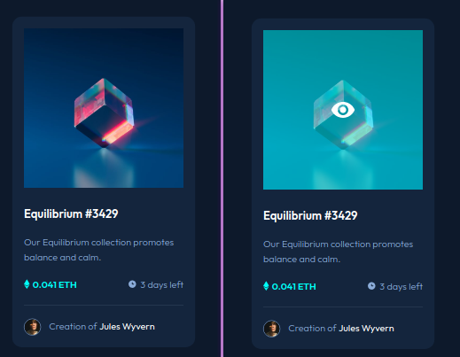

# Frontend Mentor - NFT preview card component solution

This is a solution to the [NFT preview card component challenge on Frontend Mentor](https://www.frontendmentor.io/challenges/nft-preview-card-component-SbdUL_w0U). Frontend Mentor challenges help you improve your coding skills by building realistic projects. 

## Table of contents

- [Overview](#overview)
  - [The challenge](#the-challenge)
  - [Screenshot](#screenshot)
  - [Links](#links)
- [My process](#my-process)
  - [Built with](#built-with)
  - [What I learned](#what-i-learned)
  - [Continued development](#continued-development)
  - [Useful resources](#useful-resources)
- [Author](#author)

## Overview

### The challenge

Users should be able to:

- View the optimal layout depending on their device's screen size
- See hover states for interactive elements

### Screenshot

### Links

- Solution URL: [https://github.com/marlonveiga-santos/ftm-preview-card](https://github.com/marlonveiga-santos/ftm-preview-card)
- Live Site URL: [https://marlonveiga-santos.github.io/ftm-preview-card/](https://marlonveiga-santos.github.io/ftm-preview-card/)

## My process

### Built with

- Semantic HTML5 markup
- CSS custom properties
- Flexbox

### What I learned

Good use of semantic HTML tags, avoid layout breaks. Te use of content after element and CSS3 attributes.

### Continued development

Learn mobile first principles and more useful content to not stay lost when alone with toxic teams.

### Useful resources

- [::after](https://developer.mozilla.org/en-US/docs/Web/CSS/::after) - Learn How to use after element.
- [Flexbox Guide](https://css-tricks.com/snippets/css/a-guide-to-flexbox/) - This is an amazing article which helped me finally understand XYZ. I'd recommend it to anyone still learning this concept.

## Author

- Portfolio - [Add your name here](https://marlonveiga-santos.github.io/)
- Frontend Mentor - [@marlonveiga-santos](https://www.frontendmentor.io/profile/marlonveiga-santos)
- Twitter - [@marlonvsantos](https://www.twitter.com/marlonvsantos)
